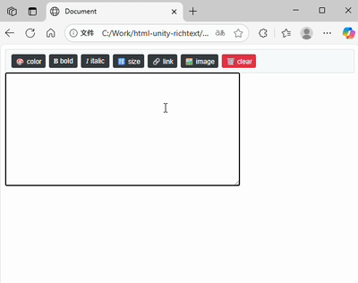

# HTML-Unity-RichText  
A lightweight rich text editor that bridges HTML formatting with Unity-style markup syntax. 

   
## Features  
- **Unity-like Syntax**: Use Unity-style markup that gets converted to HTML ,
Enables direct editing of in-game rich text content (emails, announcements, etc.) within Unity environments.
- **Live Preview**: Real-time HTML rendering as you type  
- **Extensible**: Add custom tags and validators  
- **Responsive**: Works on both desktop and mobile browsers  
## Quick Reference 
- `<size=18>text</size>` → Font size  
- `<color=#EA1A1A>text</color>` → Text color  
- `<i>text</i>` → Italic  
- `<b>text</b>` → Bold  
- `<u>Text</u>` → Underlines text 
- `<link=URL>text</link>` → Hyperlink  
- `$img:imageURL` → Image (must be standalone line)

## Quick Start  
```html  
<script src="./html.unity.richtext.js"></script>   
<script>  
new HURichTextEditor('#myTextarea','#previewContainer');  
</script>  
```

---
# zh-cn:
# 轻量级Unity富文本编辑器  
实现Unity标记语法与HTML格式无缝转换的富文本编辑工具
 
## 核心特性  
- **Unity风格语法**：支持Unity原生标记，自动转换为标准HTML ，可以直接编辑unity游戏中邮件，公告等富文本内容  
- **实时可视化预览**：输入时同步渲染HTML效果，所见即所得  
- **可扩展架构**：允许开发者自定义标签和验证规则  
- **全端适配**：完美兼容桌面浏览器和移动设备  

## 语法速查
- `<size=18>文字</size>` → 字号  
- `<color=#EA1A1A>文字</color>` → 颜色  
- `<i>文字</i>` → 斜体  
- `<b>文字</b>` → 加粗  
- `<u>文字</u>` → 下划线
- `<link=网址>文字</link>` → 链接  
- `$img:图片URL` → 图片（需独占一行）